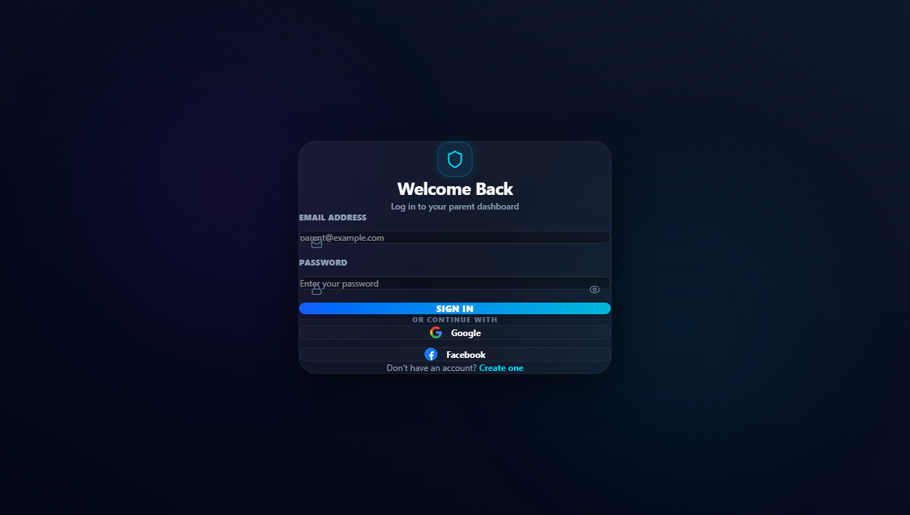
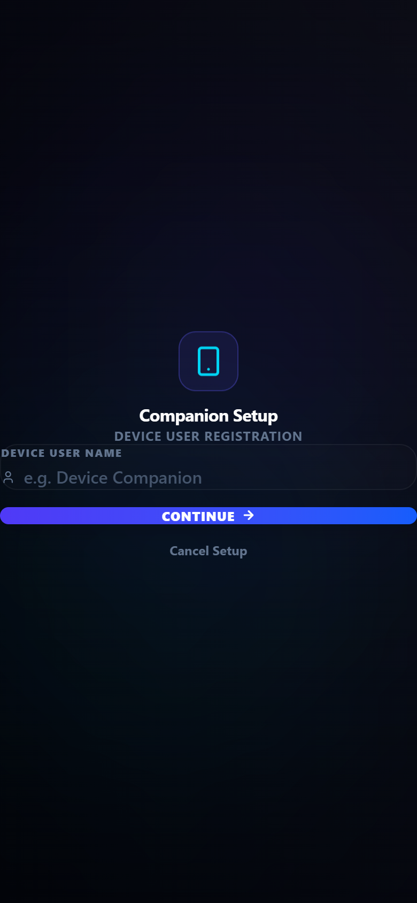

<div align="center">
  
  <h1 align="center">AlphaGuard AI (Child Shield)</h1>
  <p align="center">
    <strong>Real-time family safety, screen-time control and AI insights for parents and children</strong>
  </p>
  <p align="center">
    <a href="https://alphaguard-v2.vercel.app/welcome"></a>
  </p>
  <p align="center">
    
    
    
    
    
  </p>
</div>

<hr />

## 🌐 Try It

| Platform | Link |
|---|---|
| **Web app** (parent and child) | **https://alphaguard-v2.vercel.app/welcome** |
| **Android app** (Flutter) | Build from `alphaguard_flutter/` (see [Running locally](#-running-locally)) |
| **Backend API** | `https://alphaguard-backend-v2.onrender.com` (Render free tier, so the first request after idle can take ~30s) |

Open the web app on a phone for the best experience. It is designed mobile-first and works like a native app.

---

## 💡 What It Does

AlphaGuard AI connects a **parent device** and a **child device** through a realtime backend. Parents set rules, track location and approve requests. Children get a friendly companion app with tasks, rewards, SOS and an AI buddy. Every change syncs instantly over Socket.IO.

The same product ships as:
- a **web app** (React 19 + Vite), deployed on Vercel
- a **native Android app** (Flutter) that uses the same V2 backend unchanged

---

## ⚡ Features

### 👨‍👩‍👧 Parent app
- **Onboarding and setup**: guided teaching tour, role selection, email/password or Google sign-in, a step-by-step parent setup wizard and a permissions center
- **QR pairing**: link a child device by scanning a QR code or entering a pairing code
- **Dashboard**: live child status, battery, activity, alerts and a daily summary
- **Controls hub**: screen-time limits, night mode, per-app management and configuration
- **Location and safety**: live map, geofenced safe zones, emergency/SOS center
- **Tasks, targets and rewards**: assign tasks, set goals and reward progress
- **Approvals center**: review child requests and photo-proof task submissions
- **AI insights**: AI reports, analytics, a detection center and *Disha*, a voice-enabled AI assistant
- **Link safety**: URLhaus-powered malicious link detection
- **Monitoring and notifications**: categorised alerts, activity feed and parent–child chat
- **Privacy and compliance**: consent flow, legal pages, data export and account deletion

### 🧒 Child app
- Simple activation and pairing with the parent device
- Home with daily tasks, goals, rewards and achievements
- **SOS button** and trusted contacts
- **Disha**, a child-safe AI buddy with text and voice chat
- Chat with parents, settings and profile

### 🌍 Built for everyone
- **40+ languages**, including English, Hindi, Telugu, Tamil, Kannada, Malayalam, Marathi, Bengali, Odia, Urdu and many international languages
- Dark premium UI with smooth animations, responsive from phones to tablets
- App lifecycle handling: splash screen, update / force-update gate and a "what's new" screen

---

## 🛠️ Architecture

```
┌──────────────────────┐        ┌──────────────────────┐
│  Web app (React 19)  │        │  Android (Flutter)   │
│  Vercel              │        │  APK                 │
└──────────┬───────────┘        └──────────┬───────────┘
           │      REST + Socket.IO (JWT)    │
           └───────────────┬────────────────┘
                 ┌─────────▼──────────┐
                 │  backend-v2        │
                 │  Express+Socket.IO │──► PostgreSQL
                 │  Render            │
                 └────────────────────┘
```

> The V2 source (web, backend, Flutter and Android agent) is developed on the [`v2-foundation`](https://github.com/bhuvan-somisetty/ChildShield/tree/v2-foundation) branch.

| Folder | What it is | Stack |
|---|---|---|
| `frontend-v2/` | Web app (parent + child) | React 19, Vite, Tailwind CSS 4, Framer Motion, React Router 7, Leaflet / MapLibre, Socket.IO client |
| `alphaguard_flutter/` | Native Android app | Flutter 3.27+, go_router, Provider, Dio, socket_io_client, flutter_map, mobile_scanner, Firebase Messaging |
| `backend-v2/` | Realtime API server | Node.js 20, Express, Socket.IO, PostgreSQL (`pg`), JWT, bcrypt, Google auth |
| `android-agent/` | Native Android enforcement module | Kotlin / Android |
| `frontend/`, `backend/`, `childshield-mobile/` | Legacy V1 (React Native / Expo + SQLite) | Kept for reference |

---

## 🚀 Running Locally

**1. Backend**
```bash
cd backend-v2
npm install
cp .env.example .env    # set DATABASE_URL, JWT_SECRET, etc.
npm run dev             # http://localhost:4000
npm test                # run the backend test suite
```

**2. Web app**
```bash
cd frontend-v2
npm install
npm run dev             # http://localhost:5173
```

**3. Flutter app**
```bash
cd alphaguard_flutter
flutter pub get
flutter run                     # on a connected device or emulator
flutter build apk --release     # build a release APK
```

---

## ☁️ Deployment

- **Web**: `frontend-v2` on **Vercel**, live at https://alphaguard-v2.vercel.app
- **Backend**: `backend-v2` on **Render** via `backend-v2/render.yaml`, with database migrations running on boot
- **Android**: `flutter build apk --release` / `flutter build appbundle` for the Play Store

---

## 📸 Screenshots

| Welcome | Login | Child pairing |
|---|---|---|
|  |  |  |

---

## 👤 Author

**Bhuvan Somisetty**: [@bhuvan-somisetty](https://github.com/bhuvan-somisetty)
